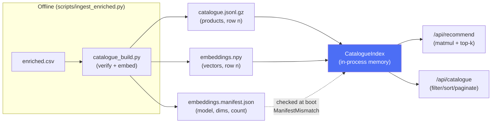

# Architecture

Curate turns a natural-language shopping request into grouped, explained product
recommendations. This document covers how, and — more usefully — why each
decision went the way it did.

The system is two pipelines sharing one store. An **offline** pipeline turns
1.59M raw CSV rows into a catalogue plus an embedding matrix. A **runtime**
pipeline turns a query into recommendations against those artifacts. They meet at
three files in `backend/data/` and nowhere else. A **catalogue browsing** API
reads the same loaded catalogue as the runtime pipeline — not a separate
surface with its own store.

| Document | Covers |
|---|---|
| [README.md](README.md) | What it does, API, setup, env, troubleshooting |
| **this file** | Runtime design, trust tiers, why each decision went this way |
| [frontend/README.md](frontend/README.md) | Streaming state machine, SSE parsing, component rules |
| [ATTRIBUTION.md](ATTRIBUTION.md) | Dataset licence (ODC-By) and its limits |
| [DEPLOYMENT.md](DEPLOYMENT.md) | Render + Vercel plan, env, failure modes |

## A request, end to end

*"3 days trekking in Manali in December, under ₹8,000"*

| Stage | What happens |
|---|---|
| **intent** | Model returns `activity: trekking`, `destination: Manali`, `duration_days: 3`, `budget_max: 8000`. It does **not** return `gender` — nobody said. Season is inferred, so it lands in `assumptions` as *"cold-weather conditions likely"*, confidence medium, not as a fact. Sub-needs come back as `Insulation`, `Footwear`, `Daypack`. |
| **filter** | `price > 8000` excluded — price is source-grounded, so it may exclude. Gender skipped: unstated. |
| **retrieve** | Three embeddings, not one. `Insulation` finds jackets, `Daypack` finds rucksacks. A single vector for the whole sentence would have found neither well. Top 8 each, unioned and deduped by product id. |
| **prerank** | Scored, and colour variants of one fleece collapse to one via the shared `variant_key`. Top 5 per sub-need survive. |
| **rerank** | Model picks 3–5 per group and writes a reason each. It may say *"suited to cold-weather trekking"*; it may not say *"rated to −12°C"* unless that string is in the title. Any id it invents is dropped on the way out. |
| **response** | Groups in the order the sub-needs came back. If `Daypack` had no decent candidate, it returns empty with a reason rather than vanishing. |

Now the same request with a `session_id` and the text *"make it cheaper"*: only
`budget_max` changes, everything else is carried forward by
`ShoppingIntent.merge()`, and the pipeline re-runs against the tighter constraint.

## The runtime pipeline

One request runs five stages, all inside a single async generator,
[app/services/pipeline.py](backend/app/services/pipeline.py). The streaming route
forwards its events; the JSON route drains them through `collect()`. One
implementation, two transports — streaming can be removed without touching the
core.

```
query
  │
  ├─ 1. intent     LLM   → ShoppingIntent + sub-needs + assumptions   ─┐ event: understood
  │
  ├─ 2. filter     code  → row subset surviving hard constraints       │
  ├─ 3. retrieve   vec   → top-8 per sub-need, unioned, deduped       ─┤ event: searching
  │
  ├─ 4. prerank    code  → top-5 per sub-need, variant-penalised       │
  ├─ 5. rerank     LLM   → 3-5 picks per group + one reason each      ─┤ event: results
  │                                                                    │
  └─ timings                                                          ─┘ event: done
```

Every stage logs one structured JSON line with `request_id` and `duration_ms`,
and the `done` event carries per-stage timings, so a slow request is attributable
without a profiler. One measured run against the synthetic catalogue with Gemini:

```
intent 8,098 ms · retrieval 6 ms · prerank 1 ms · rerank 32,134 ms · total 40,239 ms
```

**The two LLM calls are the entire cost.** Retrieval and pre-ranking together are
7 ms — 0.02% of the request. That ratio is the justification for every
"deterministic Python instead of a service" decision below, and it is why
streaming exists: the user sees `understood` about eight seconds in, rather than
staring at a spinner for forty.

### Stage 1 — Intent → sub-needs

[app/services/intent.py](backend/app/services/intent.py)

The core AI decision is **decomposition**. "Trekking essentials and clothing"
becomes two sub-needs, each with its own search phrase, and each sub-need becomes
one result group. Groups therefore derive from the request rather than being
invented after the fact.

The prompt is constrained hard in three places:

- `budget_max` and `gender` are set **only if stated**. The model never guesses a
  budget — the difference between a ₹2,000 and a ₹50,000 gift is not inferable.
- No unverifiable facts. The model has no weather or geography data, so
  *"cold-weather conditions likely"* is allowed and *"sub-zero nights at 4,200 m"*
  is not.
- Every unstated judgement goes into `assumptions`, which the UI renders as chips.

A `clarifying_question` may come back but never blocks: results are always
returned alongside it.

Parsing is deliberately tolerant — malformed assumptions are dropped rather than
failing the request. Zero usable sub-needs is the one hard failure, since there is
nothing to search for.

**Follow-ups merge rather than replace.** On a request carrying a `session_id`,
the prior intent is injected into the prompt, the model returns only what changed,
and `ShoppingIntent.merge()` overwrites with non-None delta fields only.

### Stage 2 — Hard filters

[app/services/retrieval.py](backend/app/services/retrieval.py)

The LLM decides *what* a constraint is. This module decides *which rows survive
it*, because arithmetic over thousands of rows must be exact and testable — and
because embeddings do not encode price.

Filtering obeys the trust tiers below. Price is source-grounded, so `budget_max`
excludes directly. Gender excludes only when title-verified: an enrichment mistake
must degrade ranking, never hide a product. Unstated constraints are skipped.

**Empty results widen rather than fail.** If a budget filters everything out it is
relaxed by 1.25× and the user is told; if that still yields nothing, budget is
dropped and the user is told that instead. Every relaxation surfaces in the
response — the system never quietly ignores a constraint.

### Stage 3 — Per-sub-need retrieval

Each sub-need's search phrase is embedded and cosine-searched against the filtered
subset, top 8 each. Vectors are L2-normalised at build time, so cosine is a plain
dot product: a NumPy matmul over the subset rows with an `argpartition` top-k.

Results union across sub-needs and deduplicate by product id, keeping the highest
similarity and the sub-need that produced it. **This dedup is global, not
per-sub-need**: two overlapping sub-needs competing for the same product are a
real mechanism, not a hypothetical — "trekking essentials" and "trekking
clothing" both surfacing the same jacket is exactly this shape, and only one of
them keeps it. See [Future improvements](README.md#future-improvements).

### Stage 4 — Deterministic pre-ranking

[app/services/scoring.py](backend/app/services/scoring.py)

This stage exists to make the LLM the final semantic *judge* rather than the
entire ranker, and to cut the rerank prompt from 8 candidates per sub-need to 5.

```
score = similarity
      + 0.10 × normalised quality score
      + 0.08 × (any intent term matches a verified attribute)
      + 0.04 × (any intent term matches an inferred attribute)
      − 0.15 × (title-variant already seen in this group)
```

Weights are deliberately conservative and similarity dominates. There are no
relevance judgements to fit against, so tuned coefficients would be guesses that
silently distort ranking and are harder to debug than plain similarity order. A
test asserts the adjustments sum below the similarity range, so no combination of
boosts can overturn a real similarity gap.

Two properties matter:

- **Sub-needs are ranked independently, from this stage onward.** A strong
  sub-need cannot starve a weak one *within pre-ranking* — every group gets its
  own shot at the LLM. This does not undo a collision that already happened one
  stage earlier: a sub-need can reach Stage 4 with fewer than `top_k` candidates
  because Stage 3's dedup already gave a shared product to a competing sub-need.
- **Near-duplicates are demoted, not dropped.** A sub-need whose entire candidate
  pool is colour variants of one product still returns something.

Variant detection uses the first five title tokens
([app/core/text.py](backend/app/core/text.py)). Amazon India titles are
brand-first and keyword-dense — five tokens reaches the product type on most
listings while leaving the colour word outside the key. Six tokens, which the
original plan specified, includes the colour word and collapses nothing.

### Stage 5 — LLM rerank and explain

[app/services/ranking.py](backend/app/services/ranking.py)

The model picks 3–5 per group and writes one sentence each. Three guards make this
safe to ship:

1. **Every returned `product_id` is validated against the candidate pool.**
   Hallucinated ids are dropped silently — a recommendation that doesn't exist in
   the catalogue can never reach the UI.
2. **Explanations may cite only grounded facts.** Candidate lines carry verified
   attributes explicitly labelled. Anything else must be phrased as suitability
   (*"suited to cold-weather trekking"*), never as a specification (*"rated to
   −12°C"*).
3. **Empty groups are reported, not hidden — with one gap.** Output iterates the
   original sub-needs in order, whether or not the model returned picks, and an
   empty group carries a reason string. But `build_groups()` doesn't leave it
   empty: when the model declines every candidate for a sub-need, it pads the
   group with the closest-scoring retrieved candidates instead, with no
   similarity floor gating that fallback — so "empty and honest" can silently
   become "padded with a weak match." See [Future improvements](README.md#future-improvements).

## Data trust tiers

The single most important rule in the system, governing both pipelines. Every
product attribute carries a `source`:

| Tier | `source` | May hard-filter | May rank | May be stated as fact |
|---|---|---|---|---|
| A — source-grounded (price, rating, reviews, URLs) | n/a | yes | yes | yes |
| B — extracted **and** verified against the original title | `title_verified` | yes | yes | yes |
| C — inferred by enrichment | `inferred` | **no** | yes | no |
| — absent | `None` | no | no | no |

`Product.verified(name)` returns a value only at tier B; `Product.attr(name)`
returns anything. Any code path that excludes a product must use `verified()`.

The asymmetry is the point: a wrong inferred attribute costs a slightly worse
ranking, while a wrong hard filter makes a product invisible with no way for the
user to discover the mistake.

Verification runs against `title_original`, never a translation — a translation
artifact must not be able to manufacture a verified fact. The synthetic catalogue
is built through the same verifiers, so a tier violation shows up as a test
failure rather than a fixture quirk.

Corollary: **missing metadata beats fabricated metadata.**

## Providers

[app/providers/](backend/app/providers/)

### Generation: an ordered chain

`FallbackChain` tries each provider in turn. A provider with no credential is
skipped at construction rather than failing the chain, so a chain of four starts
fine for someone holding two.

The original design capped this at two providers, because each additional one
multiplies prompt-compatibility testing across differing structured-output support
and error semantics. **That cap was lifted deliberately, and the cost was paid
immediately**: `parse_json_response` now tolerates ``` fences and preambles,
which the two SDK-based providers never needed. The reason for lifting it is that
free-tier rate limits, not provider outages, are what actually stops this
application.

Cerebras and GitHub Models share one `OpenAICompatibleGeneration` implementation —
same bearer-token `POST /chat/completions` shape, so they are configuration rather
than code, and a fix to one cannot need porting to the other.

**Rate limits are distinguished from failures.** If every provider refused on
quota the caller gets `RateLimited` (429, `retryable: true`); a single hard failure
anywhere gives `ProviderUnavailable` (503). "Come back shortly" and "this is
broken" are different answers and a client can act on the difference.

### Key rotation, and why it is not fallback

[app/providers/keys.py](backend/app/providers/keys.py)

Several credentials per provider; a 429 advances the ring and retries. Two rules
carry the design:

- **Rotate only on rate limits.** A malformed prompt, a bad model name or a
  revoked key fails identically on every key. Rotating would multiply one error
  into N, bury the real message, and burn every key's quota discovering the same
  thing.
- **Rotation is not fallback.** A second key is the same model producing vectors
  in the same space. A second provider is not. That is precisely why embeddings
  may rotate keys and may never change provider.

Rate limits are detected by shape — a 429 status on the exception or its response,
or a message matching `rate limit`/`quota`/`resource exhausted` — rather than by
each SDK's exception classes, which would make three SDKs a hard import.

### Embeddings have no fallback chain

Query vectors must come from the same model and dimensionality as the catalogue
matrix. A dynamic swap would put them in a different vector space, cosine would
still return entirely plausible-looking numbers, and every result would be noise
with nothing to debug against. So a missing embedding provider is a hard failure
and `EMBEDDING_MODEL` / `EMBEDDING_DIMS` are pinned config.

This is enforced at startup. `load_index()` compares the configured model and dims
against `embeddings.manifest.json` and raises `ManifestMismatch` if either
differs; `CatalogueIndex.__init__` additionally refuses a product count that
doesn't match the matrix row count. Both fail at boot, not at first query.

**Model ids are configuration, not code.** Two of them retired within a day of
being written (`gemini-2.5-flash` became unavailable to new keys;
`llama-3.3-70b` does not exist on Cerebras' current catalogue). A retired id
passes every offline test and fails at the first real request, so
`scripts/check_providers.py` exists to test each credential against the live API
before anything depends on it.

### Keyless stand-ins

Both provider kinds have keyless implementations, so the entire application runs
with no credentials:

| | Real | Keyless |
|---|---|---|
| Embeddings | `gemini-embedding-001` or `jina-embeddings-v3`, 768d | `hashing-bow-v1`, 256d — hashed bag of words |
| Generation | Gemini / Groq / GitHub Models | `MockGeneration` — keyword rules |

`MockGeneration` matches keywords rather than reading a request, but **the
grounding rule is not relaxed for it**: every explanation is assembled from fields
the candidate actually carries, and it has no source for a specification, so it
cannot state one. A demo provider that fabricated plausible specs would
misrepresent the exact property this architecture exists to guarantee.

`HashingEmbedding` has a known weakness worth stating plainly: **no IDF.** A title
sharing "cotton" or "women" scores as highly as one sharing "thermal", so a search
for "thermal base layer" can rank a saree above a thermal vest. It is a fixture
for exercising the machinery, not a retrieval system.

## Storage: one in-memory catalogue, two access patterns

There is no database. One set of artifacts, on disk, loads once into process
memory, and both `/api/recommend` and `/api/catalogue` read out of that same
loaded state.



### Recommendation reads files, not a database

`app/catalogue/loader.py` + `app/catalogue/index.py` load three files from
`DATA_DIR` (defaults to `backend/data/`) once, in the FastAPI lifespan hook,
and keep them in process memory for the life of the worker:

| File | Contents | Loaded as |
|---|---|---|
| `catalogue.jsonl.gz` | one JSON object per product — id, title, price, category, attributes dict, etc. | `list[Product]`, `app/catalogue/loader.py` |
| `embeddings.npy` | one row per product, L2-normalised, row *n* matches JSONL line *n* | `np.ndarray`, `app/catalogue/index.py:63` |
| `embeddings.manifest.json` | `{model, dims, count, normalised, dtype, built, synthetic}` | checked, not loaded into the index |

`load_index()` refuses to start if `manifest["model"]`/`manifest["dims"]`
disagree with the configured `EMBEDDING_MODEL`/`EMBEDDING_DIMS`
(`ManifestMismatch`, `app/catalogue/index.py:53-60`), and `CatalogueIndex.__init__`
separately refuses if the product count doesn't match the matrix row count
(`app/catalogue/index.py:23-25`). Both are boot-time failures — see
[Embeddings have no fallback chain](#embeddings-have-no-fallback-chain) above
for why a mismatch here is worse than a crash.

There is no query language and no server round trip: `CatalogueIndex.search()`
is a NumPy matmul, `matrix @ query_vec`, because vectors are pre-normalised so
the dot product *is* the cosine similarity, followed by an `argpartition` top-k
(`app/catalogue/index.py:39-46`). A boolean row mask handles the hard-filter
subset from Stage 2, so filtering costs nothing extra — it's the same matmul
over fewer rows, not a second pass.

Measured on this machine at the shipping shape (22,000 × 768 fp16): cosine +
top-50 in 1.11 ms, the same with price and category filters in 1.09 ms — the
filtered case isn't slower because the mask is applied before the matmul, not
after. A pgvector round trip is 1–3 ms *before doing any work*, so a database
would be slower here, and the pre-filter-versus-post-filter problem that makes
hybrid retrieval awkward in vector databases does not exist at this scale — the
whole matrix fits comfortably in cache, so there's no index to keep in sync
with the filter.

The catalogue actually committed at `backend/data/` right now is smaller than
that measured shape: 6,000 real Amazon India products, `jina-embeddings-v3` at
768 dims, float16, `synthetic: false` (`backend/data/embeddings.manifest.json`,
built by `scripts/ingest_enriched.py --embedder jina`, see
[Offline pipeline](#offline-pipeline)). At 6,000 rows the matrix is ~8.8 MB —
brute-force search over it is microseconds, well under the measured 22k-row
numbers above. `backend/data/mock/` holds a parallel synthetic catalogue of the
same shape, reachable via `DATA_DIR=data/mock`, for the zero-credential path.

### Catalogue browsing reads the same list

`/api/catalogue` (`app/api/routes_catalogue.py`) filters, sorts and paginates
across the same `list[Product]` loaded above, via `app/catalogue/browse.py` —
pure functions (`filter_products`, `sort_products`, `paginate`,
`category_counts`, `domain_counts`, `find_product`) with no FastAPI and no I/O,
reached through a `deps.get_products()` dependency that just returns
`get_pipeline().index.products`.

There used to be a second store here: Postgres, seeded one-way from the same
JSONL by a `scripts/seed_db.py` script, because filter/sort/pagination over a
Python list felt like reinventing what SQL does natively. It was removed. At
this catalogue's size — a few thousand rows, read-only, no runtime writes, and
already resident in process memory for recommendation — that tradeoff didn't
hold: a second store can't mirror the first any more freshly than just reading
it directly, and a list comprehension plus a sort over a few thousand rows
costs microseconds, so there was nothing left for a database to be faster at.
Against that: a service to provision, a connection pool to size, inline DDL to
keep idempotent, a `CATALOGUE_UNAVAILABLE` error path for when it was
unreachable, and a one-way sync script whose only job was keeping a copy from
drifting out of a first copy that was already authoritative. One data source
is simpler to reason about than two kept in sync.

Sorting breaks ties on product `id` ascending, regardless of sort direction:
Python's `sorted()` is stable, so sorting by `id` first and then doing a second
stable sort on the real key keeps tied rows (ratings and quality scores tie
constantly at this size) in deterministic order without a product silently
appearing on two pages or none.

### If this stops being the right call

Revisit this at: ~500k+ vectors (a same-process array stops being the cheap
option), multiple worker processes needing a consistent shared view of the
matrix (a process-local list doesn't help worker B), a runtime write path
(there isn't one today — the offline pipeline is the only writer), or filter/
sort needs that a list comprehension expresses worse than SQL would — none of
which apply yet (see [Known constraints](#known-constraints)).

## Frontend

[frontend/src/](frontend/src/) — details in [frontend/README.md](frontend/README.md)

```
App.tsx                     layout; hero collapses once a query is active
components/TopNavBar        wordmark and nav
components/SideNavBar       "concierge" rail: stage indicator, destination, budget
components/InputPanel       query box and example prompts
components/AssumptionChips  what the model inferred, plus the clarifying question
components/ResultGroup      one group heading, or its empty reason
components/ProductCard      image, price, tier, rating, and the reason
components/RefineBar        quick refinements and free-text follow-up
hooks/useRecommendation     status + stage machine, session id, partial state
lib/api.ts                  fetch client, SSE frame parser, ApiFailure
types.ts                    mirrors backend/app/schemas/response.py
```

Design tokens live in `tailwind.config.js`: a `surface`/`primary` pair and a
`gold` scale, with EB Garamond for headings and Inter for body, loaded from Google
Fonts in `index.html`.

The default submit path is streaming. `understood` arrives long before results —
eight seconds versus forty in the measured run — so assumption chips and the
clarifying question render while retrieval and reranking are still going. The wait
is filled with the system's reasoning rather than a spinner.

**Stage names are not event names.** The SSE events are `understood`, `searching`,
`results`, `done`; the hook's `stage` is `understanding`, `searching`, `ranking`,
`ready`. `onUnderstood` sets the stage to `searching`, because the UI labels what
is happening *next*, not what just arrived.

SSE parsing keeps an incomplete trailing frame in the buffer rather than
discarding it, and skips malformed payloads instead of failing the stream.

`types.ts` is hand-mirrored from the backend response schema, field names kept
identical so drift shows up as a type error rather than an undefined at runtime.

**Two known defects here**, both real and both currently shipped:

- `ProductCard` tests `price_tier` against `"mid-range"`, a value the backend never
  emits — it sends `"mid"`. That badge can never render.
- The streaming path registers no `onDone` handler, so `timings_ms` and `intent`
  reach the client as `{}` even though the backend sends both.

## Backend layout

```
app/main.py            app factory, CORS, AppError handler, lifespan warm-up
app/config.py          pydantic-settings; pinned embedding config, provider models
app/api/deps.py        provider chain construction, lru_cached pipeline singleton
app/api/routes_*.py    recommend + catalogue surfaces, error-code → status mapping
app/schemas/           intent, product, response models
app/providers/         generation + embedding, real, keyless and stub; key rotation
app/catalogue/         gzipped-JSONL loader, NumPy index, manifest check, browse.py (filter/sort/paginate)
app/services/          intent, retrieval, scoring, ranking, sessions, pipeline
app/core/              errors, structured logging, shared title normalisation
```

Dependencies run inward: `app/core/` imports nothing of ours, and offline scripts
import runtime code rather than the reverse. That is why `variant_key` lives in
`app/core/text.py` and not in `scripts/` — and why `backend/Dockerfile` does not
ship `scripts/` at all, since nothing under `app/` imports it.

## Errors

[app/core/errors.py](backend/app/core/errors.py)

All errors are `AppError` subclasses carrying `code`, `retryable` and
`http_status`, serialising to one envelope:

```json
{ "error": { "code": "PROVIDER_UNAVAILABLE", "message": "...", "retryable": false } }
```

| Code | Status | Retryable |
|---|---|---|
| `INVALID_QUERY` | 400 | no |
| `NOT_FOUND` | 404 | no |
| `RATE_LIMITED` | 429 | **yes** |
| `PROVIDER_UNAVAILABLE` | 503 | no |
| `INTERNAL` | 500 | no |

The pipeline catches `AppError` and emits it as an `error` event; the bare
`except` beneath it emits a generic `INTERNAL` envelope, so a traceback never
reaches the client — asserted by a test that raises an exception containing a
password and checks it cannot appear in the response.

Empty result *groups* are not an error. They are a normal response body.

## How this is tested

214 backend tests and 56 frontend tests, no network and no credentials. Every
provider has a stub, so the whole pipeline runs offline and CI needs no secrets.

4 backend tests and 4 frontend tests currently fail. Backend: 4 tests in
`test_pipeline.py` fail because a vague *first-turn* query raises
`INVALID_QUERY` before the clarity gate that should handle it runs — a real
regression, see [Future improvements](README.md#future-improvements) #1.
Frontend: `api.test.ts` calls `listCatalogue` with its old positional
signature after it moved to a filters object; `CartPage.test.tsx` asserts text
that now matches two elements; two `ExplorePage.test.tsx` tests fail because
the component throws when mounted under the test's fetch stub, not yet
root-caused. None of these are database- or catalogue-migration-related —
stale/brittle tests and one real regression, not flakiness.

`StubGenerationProvider` returns a scripted list of dicts and records the prompts
it was given, so a test can assert what the model was actually asked.
`StubEmbedding` hashes text to a deterministic vector. `MockGeneration` and
`HashingEmbedding` go further — they run the real pipeline end to end against the
synthetic catalogue, which is how the API, streaming and session paths are
exercised without a key.

What this buys, and what it does not: orchestration, filters, scoring arithmetic,
id validation, key rotation and every error path are covered exactly. **Prompt
quality is not** — no stub can tell you whether the model decomposes a real
request sensibly, which is why the prompts carry their rules explicitly and why
the ranking stage validates rather than trusts. `scripts/check_providers.py`
covers the other gap tests cannot: whether a credential and model id actually
work.

## Known constraints

- **Single worker.** `SessionStore` is a process-local TTL dict. With multiple
  workers a session created on one is missing on another and refinement breaks.
  `--workers 1` is load-bearing. Redis is the production path.
- **No relevance evaluation.** `eval/queries.yaml` ships the query set; the
  harness that runs it does not exist. Ranking quality is asserted by construction
  — conservative weights, deterministic filters — rather than measured. This is
  also why the scoring weights are small and untuned.
- **Latency is dominated by two LLM calls**, ~40 s on the measured run. Streaming
  hides it rather than fixing it. Reducing the rerank candidate set or running
  sub-needs concurrently are the levers, neither yet pulled.
- **Catalogue rebuild is coupled to embedding config.** Changing the model or dims
  requires re-embedding everything before the app will start.
- **The real catalogue is built but unevaluated.** `backend/data/` holds 6,000
  real Amazon India products with real `jina-embeddings-v3` vectors (built via
  `scripts/ingest_enriched.py --embedder jina`, see [Offline pipeline](#offline-pipeline)
  and [Storage](#storage-one-in-memory-catalogue-two-access-patterns)), so
  the "not yet built" state this bullet used to describe no longer holds. What's
  still missing is a relevance evaluation against it — see the next bullet. A
  deployer must set `EMBEDDING_MODEL=jina-embeddings-v3` (the config default is
  still `gemini-embedding-001`) or re-run ingestion with `--embedder gemini` to
  match the committed manifest; a mismatch fails loudly at boot
  (`ManifestMismatch`) rather than silently, by design.

## Offline pipeline

The hygiene gate → taxonomy map → quota → enrichment → verification stages
(`docs/dataset.md` §5, `docs/taxonomy.md`) run outside this repo, against the
full 1.59M-row source CSV, producing `data/enriched.csv` (not committed, same
as the raw source CSV — a curated 6,094-row sample, not the full catalogue).
`scripts/ingest_enriched.py` is the last two stages, run in-repo:

```
data/enriched.csv (6,094 rows, pre-enriched)
  → drop unresolved category  94 rows, category_source=pending_title_inference
  → map onto Product           no schema change: direct fields + attributes dict
  → verification               tier-B claims re-checked against title_original,
                                scripts/verify_attributes.py — same gate the
                                mock catalogue uses
  → embeddings                 gemini-embedding-001 @ 768 (--embedder gemini)
                                or hashing-bow-v1 @ 256 (--embedder hashing)
  → catalogue.jsonl.gz + embeddings.npy + embeddings.manifest.json
```

**Line order is a contract.** Row *n* of the JSONL is row *n* of the matrix.
Nothing may reorder one without the other, which is why `CatalogueIndex` asserts
the counts match at load time.

`scripts/catalogue_build.py` holds the artifact-writing logic (trust-tier
tagging, embedding dispatch, the JSONL/`.npy`/manifest writer) shared by both
`scripts/build_mock_catalogue.py` and `scripts/ingest_enriched.py`, so the two
builders can't drift from the same contract. Also in `scripts/`:
`profile_dataset.py` (reproducible EDA over the 670 MB CSV, standard library
only), `verify_attributes.py` (tier-B verifiers, shared by both pipelines), and
`validate_urls.py` (structural check offline, network sampling opt-in).

## Where this goes next

Leading with the two regressions, since they're bugs, not gaps:

1. Fix the ambiguity/clarity-gate short-circuit (a first-turn vague query
   raises `INVALID_QUERY` before the gate meant to handle it ever runs).
2. Key retrieval's cross-sub-need dedup by `(sub_need, product_id)` instead of
   `product_id` alone.
3. Add a similarity floor to retrieval and to the rerank fallback.
4. Build the eval harness (`eval/queries.yaml` exists; nothing runs it) —
   property assertions first, LLM-as-judge relevance pass second.
5. IDF weighting in `HashingEmbedding`.
6. Redis-backed sessions, to lift the single-worker constraint.
7. Run sub-need reranking concurrently instead of one combined prompt.
8. Fix the two known frontend bugs (`price_tier` badge, missing `onDone`).
9. Deploy and record the demo video.

See [README.md's Future improvements](README.md#future-improvements) for the
same list with more detail on each.
